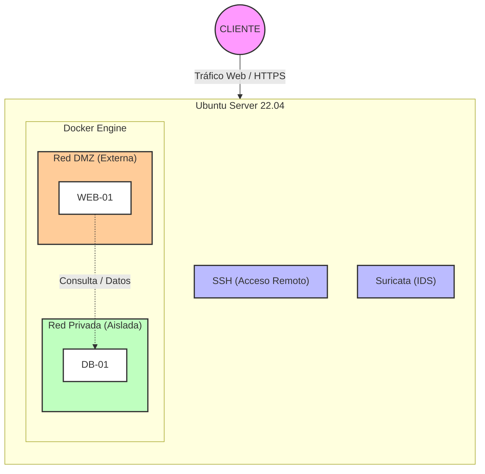

# Proyecto: Despliegue Seguro de E-commerce con Contenedores y Redes Segmentadas

- **Nombre del proyecto:** Infraestructura Segura Docker para E-commerce Artesanal (*Art i Mar Cambrils*)
- **Integrantes:** Eduardo Zavarce Forsythe
- **Temática:** Despliegue de comercio electrónico local de artesanía marinera, decoración y cerámica con WordPress y MySQL sobre una arquitectura de red segmentada.

---

## 2. Descripción breve del sistema
La infraestructura representa un servidor virtual corporativo expuesto a internet simulando el entorno de producción de una tienda artesanal local. El servicio presta una plataforma web de comercio electrónico accesible públicamente para clientes y administración. Gestiona información ficticia de catálogo de productos artesanales, altas de usuarios, pedidos y transacciones comerciales simuladas. La aplicación web (WordPress) funciona como interfaz de cara al cliente y pasarela de gestión del negocio, operando de forma aislada de los datos críticos para garantizar la resiliencia y la seguridad de la información.

---

## 3. Tecnologías y Componentes Previstos

| Componente                 | Tecnología                | Función                                                                                            |
| :------------------------- | :------------------------ | :------------------------------------------------------------------------------------------------- |
| **Sistema principal**      | Ubuntu Server 26.04.1 LTS | Sistema operativo base para la administración y alojamiento de la infraestructura.                 |
| **Acceso remoto**          | OpenSSH Server            | Administración segura y remota del servidor host mediante consola cifrada.                         |
| **Ejecución de servicios** | Docker & Docker Compose   | Orquestación y aislamiento de los servicios mediante contenedores.                                 |
| **Servicio principal (WEB-01)**     | WordPress                 | Aplicación web de comercio electrónico (tienda en línea de artesanía).                             |
| **Persistencia (DB-01)**           | MariaDB                   | Sistema de gestión de bases de datos relacionales para el almacenamiento de contenidos y usuarios. |
| **Monitorización / IDS**   | Suricata                  | Sistema de detección de intrusiones en red para la supervisión del tráfico y alerta temprana.      |

---

## 4. Arquitectura inicial

A continuación se muestra el esquema estructural que contempla el flujo de red, el acceso administrativo y la segmentación de contenedores (DMZ vs Red Privada):

## 5. Configuración de Red y Puertos

Para garantizar la seguridad y la segmentación del tráfico, los puertos se han configurado minimizando la exposición pública de los servicios internos:

| Servicio / Componente | Puerto Expuesto (Host/VM) | Puerto en Contenedor | ¿Expuesto al exterior? | Función |
| :--- | :--- | :--- | :--- | :--- |
| **OpenSSH Server** | `22` | `22` | **Sí** | Administración remota segura del servidor host. |
| **WordPress (Web)** | `80` (HTTP) / `443` (HTTPS) | `80` / `443` | **Sí** | Acceso público de los clientes al e-commerce (*DMZ*). |
| **MariaDB (Base de datos)** | Ninguno | `3306` | **No** | Uso interno exclusivo para la persistencia de datos (*Red Privada aislada*). |

