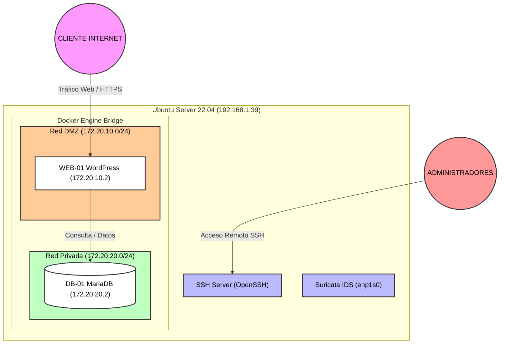

# *Art i Mar Cambrils*

- **Nombre del proyecto:**  Despliegue Seguro de E-commerce con Contenedores y Redes Segmentadas *Art i Mar Cambrils*
- **Integrantes:** Eduardo Zavarce Forsythe
- **Temática:** Despliegue de comercio electrónico local de artesanía marinera, decoración y cerámica con WordPress y MySQL sobre una arquitectura de red segmentada.

---
## 1. Guía de Instalación y Despliegue

Prerequisitos: servidor Ubuntu 22.04.5 LTS.

Para replicar y desplegar la infraestructura sobre un servidor base con Ubuntu 22.04.5 LTS, ejecute los siguientes pasos secuenciales desde la raíz del repositorio:

1. **Ejecutar los scripts de preparación del entorno e instalación:**
     ```bash
    ./scripts/00-initial-setup/00-create-folders.sh
    ./scripts/00-initial-setup/01-install-docker.sh
    ./scripts/00-initial-setup/02-install-dependencies.sh
    
     ```

2. Configurar las variables de entorno:
    
    Genere su archivo de configuración .env utilizando como base la plantilla proporcionada (template.env):

    ```bash
    cp template.env .env
    ```
    (Modifique los parámetros y credenciales dentro de .env según sea necesario para su entorno).

3. Desplegar los contenedores:

    Inicie la orquestación de servicios en segundo plano mediante Docker Compose:

    ```bash
    docker compose up -d
    ```

---

## 2. Descripción breve del sistema
La infraestructura representa un servidor virtual corporativo expuesto a internet simulando el entorno de producción de una tienda artesanal local. El servicio presta una plataforma web de comercio electrónico accesible públicamente para clientes y administración. Gestiona información ficticia de catálogo de productos artesanales, altas de usuarios, pedidos y transacciones comerciales simuladas. La aplicación web (WordPress) funciona como interfaz de cara al cliente y pasarela de gestión del negocio, operando de forma aislada de los datos críticos para garantizar la resiliencia y la seguridad de la información.

---

## 3. Tecnologías y Componentes Previstos

| Componente                 | Tecnología                | Función                                                                                            |
| :------------------------- | :------------------------ | :------------------------------------------------------------------------------------------------- |
| **Sistema principal**      | Ubuntu 22.04.5 LTS | Sistema operativo base para la administración y alojamiento de la infraestructura.                 |
| **Acceso remoto**          | OpenSSH Server            | Administración segura y remota del servidor host mediante consola cifrada.                         |
| **Ejecución de servicios** | Docker & Docker Compose   | Orquestación y aislamiento de los servicios mediante contenedores.                                 |
| **Servicio principal (WEB-01)**     | WordPress                 | Aplicación web de comercio electrónico (tienda en línea de artesanía).                             |
| **Persistencia (DB-01)**           | MariaDB                   | Sistema de gestión de bases de datos relacionales para el almacenamiento de contenidos y usuarios. |
| **Monitorización / IDS**   | Suricata                  | Sistema de detección de intrusiones en red para la supervisión del tráfico y alerta temprana.      |

---

## 4. Arquitectura inicial



## 5. Configuración de Red y Puertos

Para garantizar la seguridad y la segmentación del tráfico, los puertos se han configurado minimizando la exposición pública de los servicios internos:

| Servicio / Componente | Puerto Expuesto (Host/VM) | Puerto en Contenedor | ¿Expuesto al exterior? | Función |
| :--- | :--- | :--- | :--- | :--- |
| **OpenSSH Server** | `22` | `22` | **Sí** | Administración remota segura del servidor host. |
| **WordPress (Web)** | `80` (HTTP) / `443` (HTTPS) | `80` / `443` | **Sí** | Acceso público de los clientes al e-commerce (*DMZ*). |
| **MariaDB (Base de datos)** | Ninguno | `3306` | **No** | Uso interno exclusivo para la persistencia de datos (*Red Privada aislada*). |

[Screenshots comprobaci´ón de configuraciones](docs/validations/fase2/evidencias.md)

## 6. Mapa de Evidencias 

| Acción / Evento | Activo / Origen | Ubicación del Registro (Ruta / Servicio) | Datos Clave a Identificar |
| :--- | :--- | :--- | :--- |
| **Login SSH (Correcto / Incorrecto)** | Linux (Host) | `/var/log/auth.log` (o `journalctl -u ssh`) | Fecha/hora, IP de origen, Usuario, Resultado (Accepted / Failed). |
| **Petición HTTP (Correcta / Errónea)** | Web (`WEB-01`) / WordPress | Logs del contenedor Docker (`shop-wordpress`) | IP de origen, Hora, Método HTTP, URL, Código de Estado (200, 404...). |
| **Actividad de Contenedores** | Docker Engine | `/var/lib/docker/containers/` o `docker logs` | Timestamp, ID del contenedor, Mensajes de error o arranque. |

### Evidencias:
[Screenshots de los logs](docs/validations/fase3/evidencias.md)


---

## 7. Monitorización / IDS 

### Suricata:

Elegido el IDS suricata para monitorear y generar alertas de actividad en la subred.

Agregada una regla para alertar peticiones de ICMP (ping).

[Configuración y pruebas](docs/validations/fase4/evidencias.md)

---

## 8. Pruebas realizadas al entorno


| Acción | Fuente Principal de Registro | Detectada / Registrada | Información Obtenida (Detalles Clave) |
| --- | --- | --- | --- |
| **SSH correcto** | `/var/log/auth.log` | **Sí** | Fecha/hora, IP de origen, usuario autenticado, método de acceso (Accepted publickey/password). |
| **SSH incorrecto** | `/var/log/auth.log` | **Sí** | Fecha/hora, IP de origen, usuario intentado, fallo de autenticación (Failed password). |
| **Web válida** | Logs de contenedores Docker / WordPress | **Sí** | IP de origen, timestamp, método HTTP (`GET`), recurso solicitado (`/`), código de estado `200 OK`. |
| **Web 404** | Logs de contenedores Docker / WordPress | **Sí** | IP de origen, timestamp, recurso no existente solicitado, código de estado `404 Not Found`. |
| **Docker** | `docker logs` / Motor Docker | **Sí** | Timestamps de arranque, estado de los contenedores (`shop-wordpress`, `shop-mariadb`), mensajes de conectividad interna. |
| **Ping** | Suricata (`/var/log/suricata/fast.log`) | **Sí** | Alerta generada por regla propia (`sid:1000001`), IP origen del escaneo/ping, IP destino (`192.168.1.39`), protocolo ICMP. |
| **Nmap** | Suricata / Logs del sistema / Web logs | **Sí** | Identificación de barrido de puertos, peticiones múltiples concurrentes, registro de conexiones entrantes a servicios expuestos. |

[Screenshot de resultados](docs/validations/fase5/evidencias.md)
---

