# Evidencias y Verificación — Fase 2: Servidor e Infraestructura Docker

## 1. Ubuntu Operativo

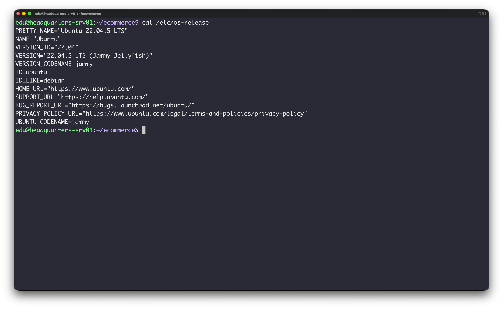

## 2. SSH Operativo
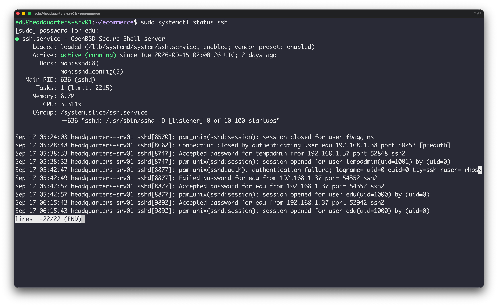

## 3. Docker Instalado

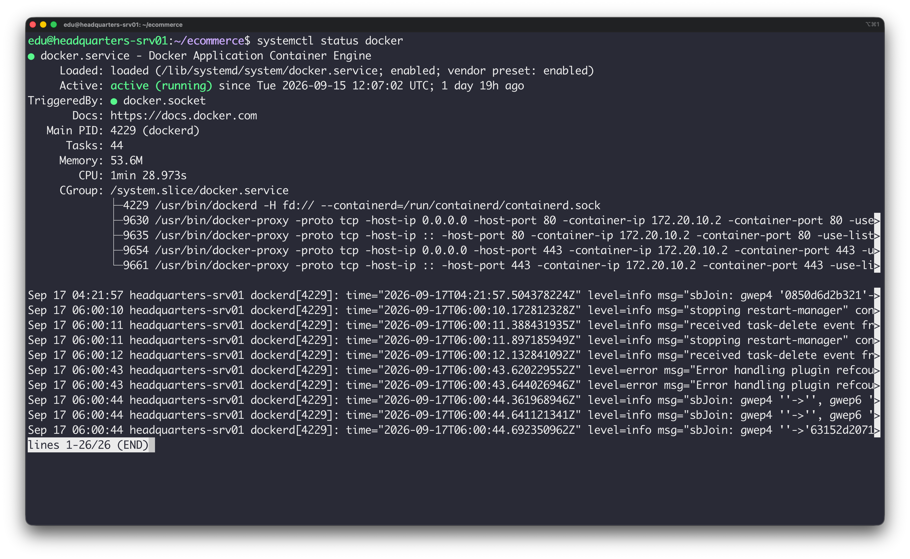

## 4. Docker Compose Instalado
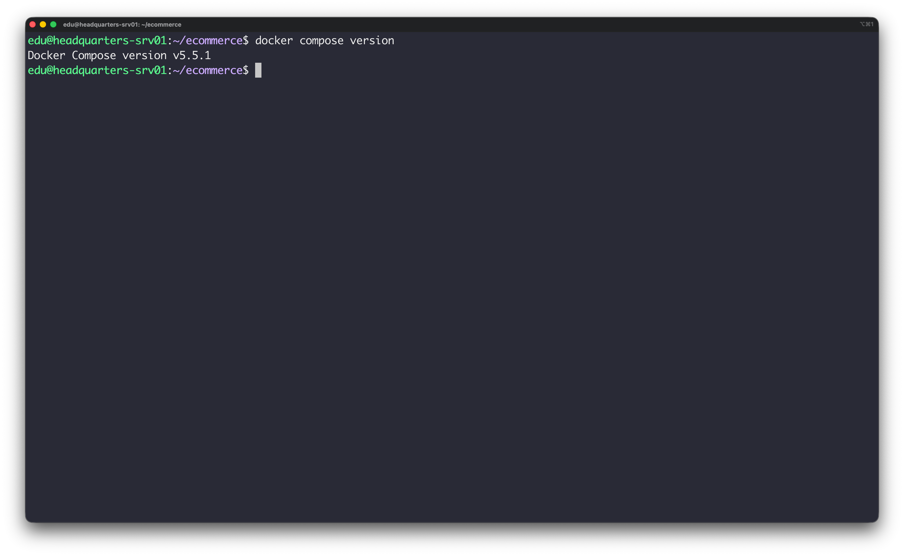

## 5. Web Funcionando (WEB-01 / WordPress)

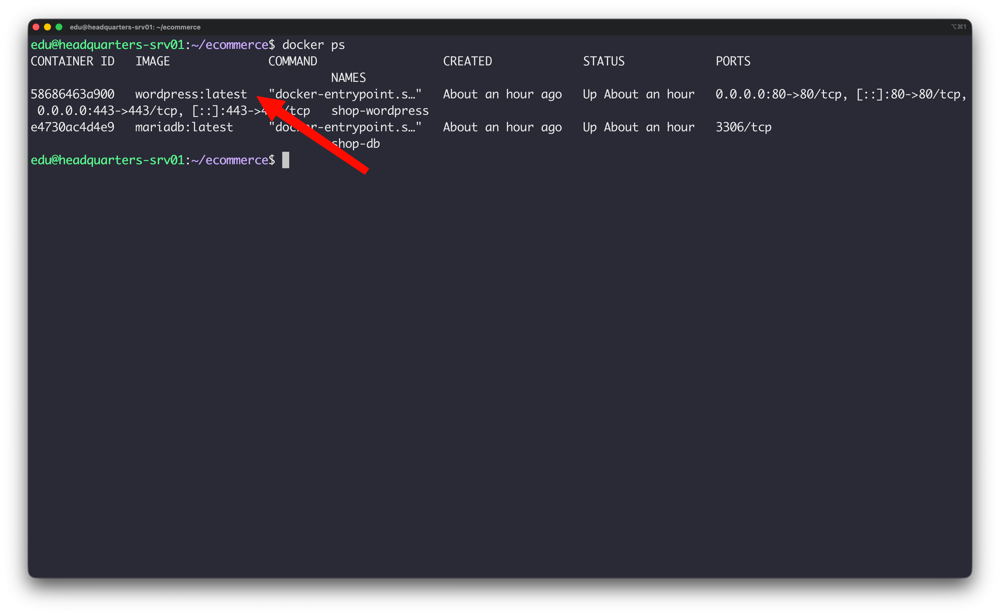

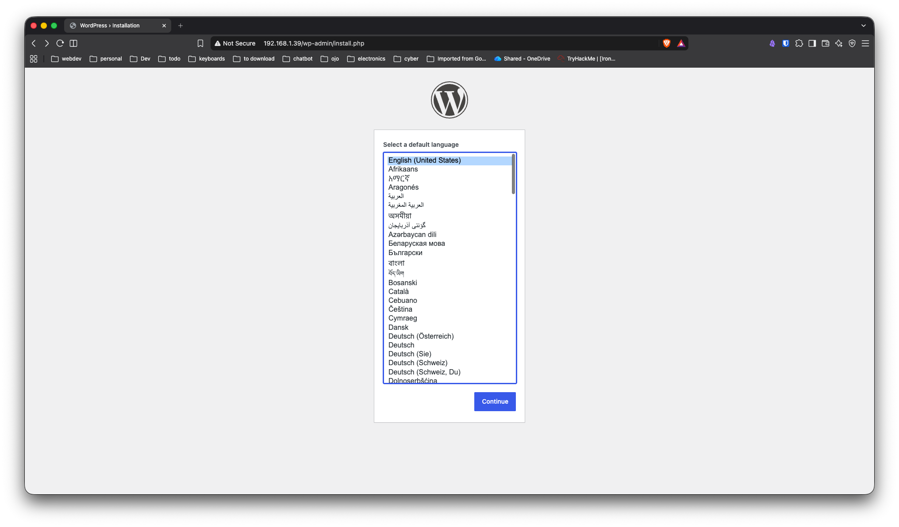

## 6. Base de Datos Funcionando (DB-01 / MariaDB)

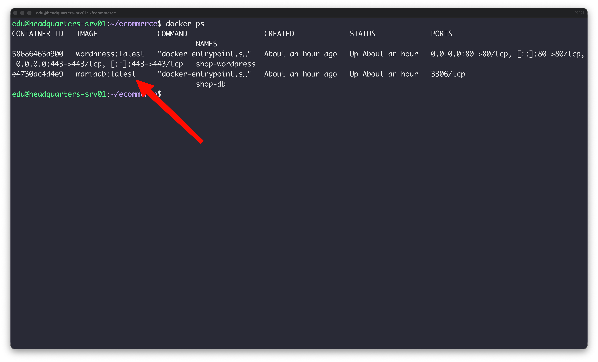

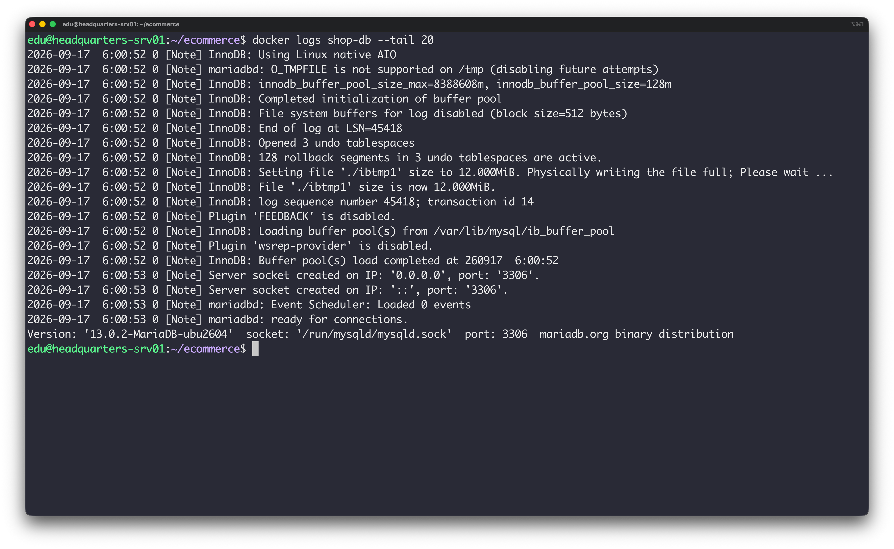

## 7. Comunicación Web ↔ DB
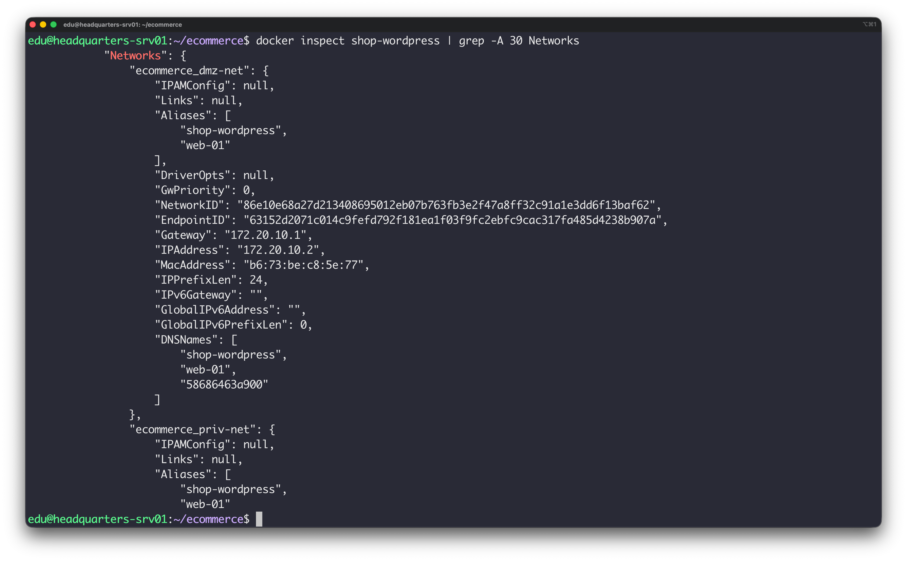

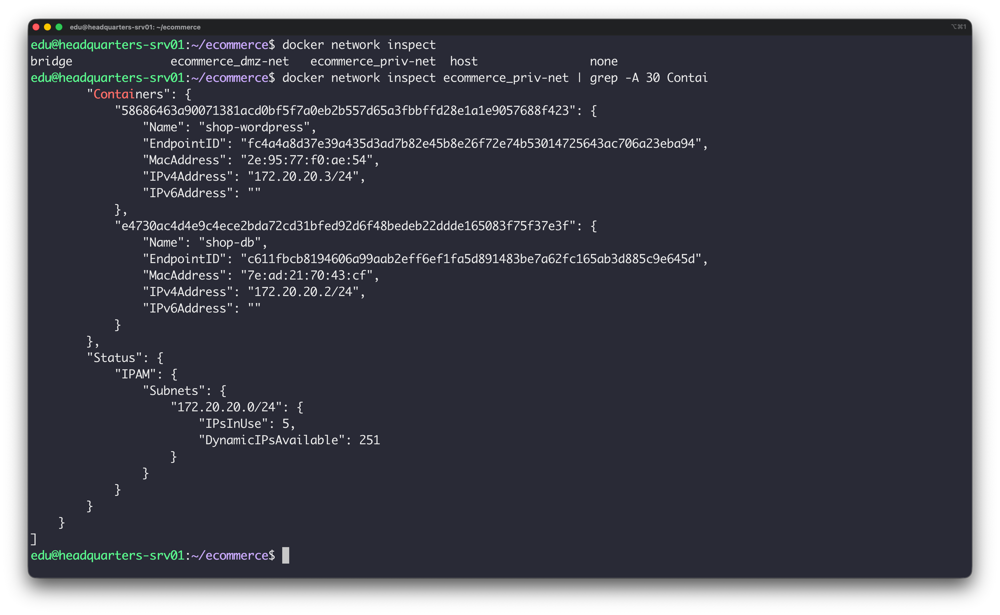

## 8. Persistencia (Bind Mounts y Volúmenes)

* **Método de comprobación:** Comprobación de que los archivos de WordPress residen en el directorio del host `/srv/wordpress` y los datos de MariaDB en el volumen Docker.
* **Comando ejecutado:**
```bash
ls -la /srv/wordpress
docker volume ls

```
- Wordpress bound directory: 

	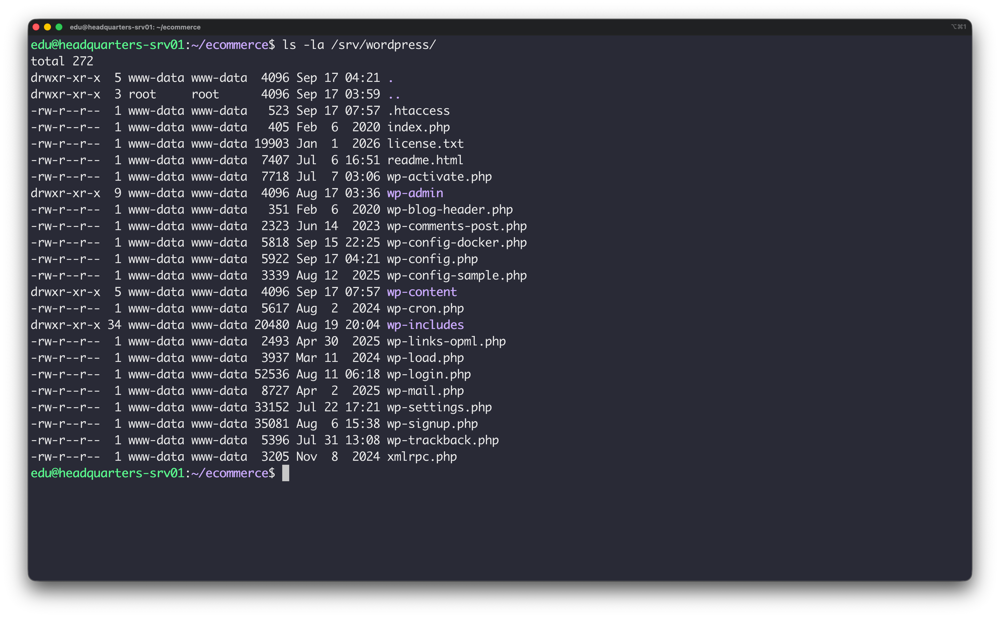
- MariaDB volume: 

	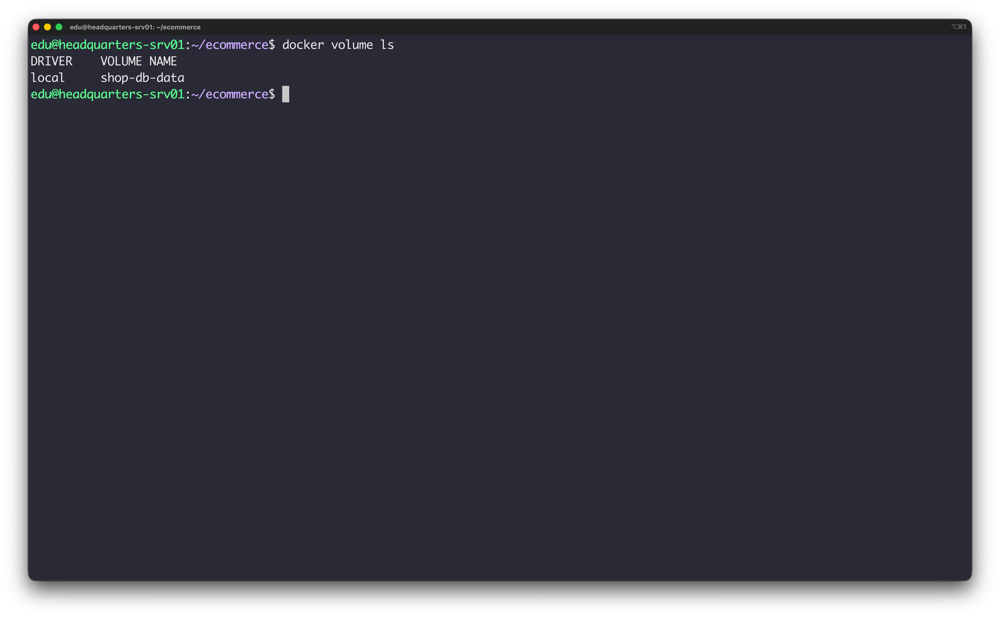

## 9. Puertos Documentados

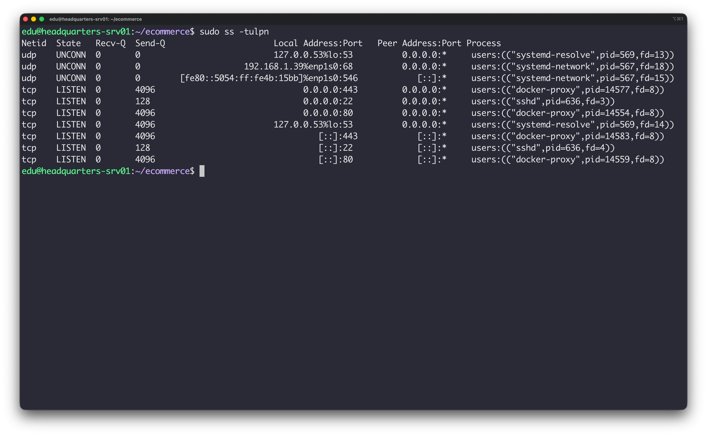
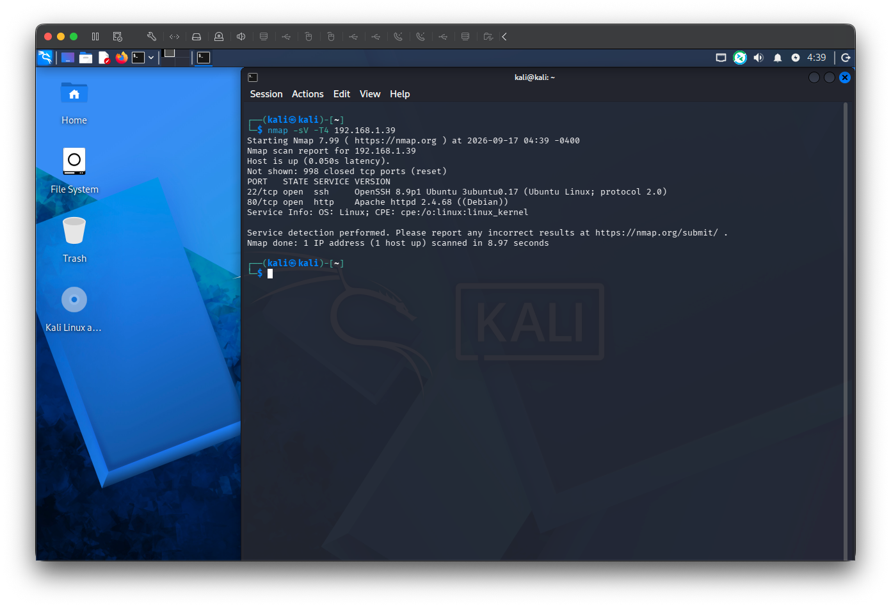


## 10. GitHub Actualizado

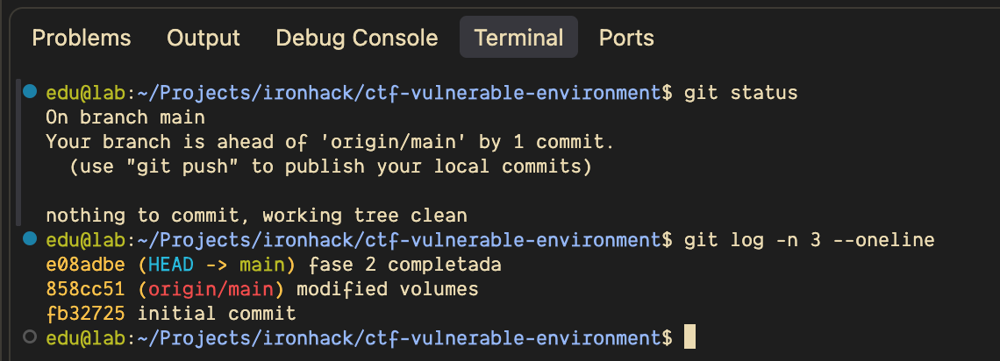

