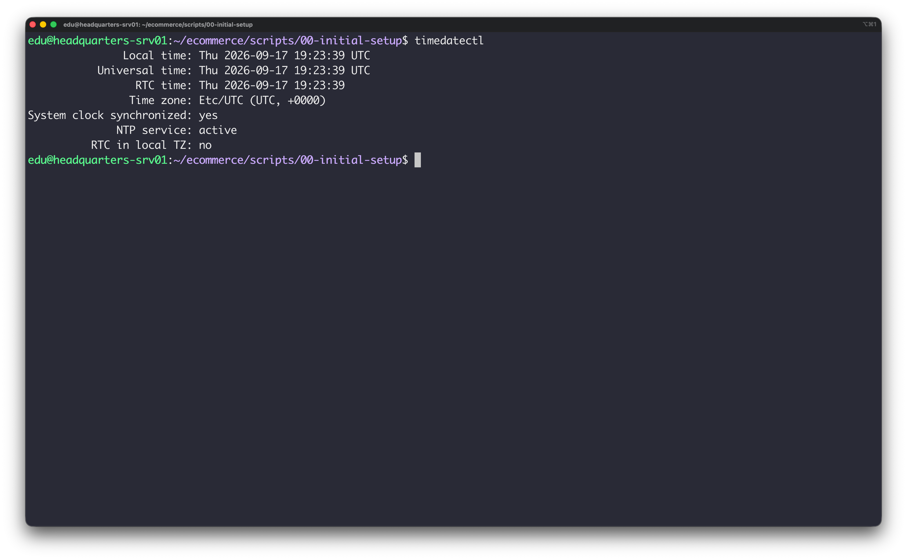
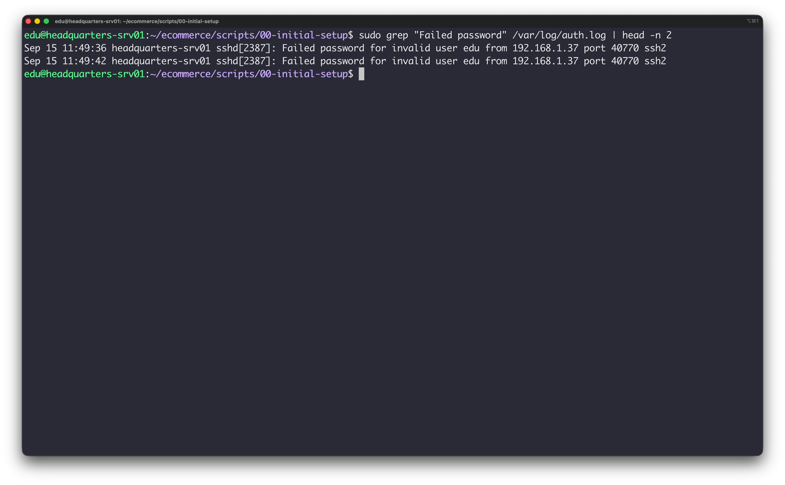
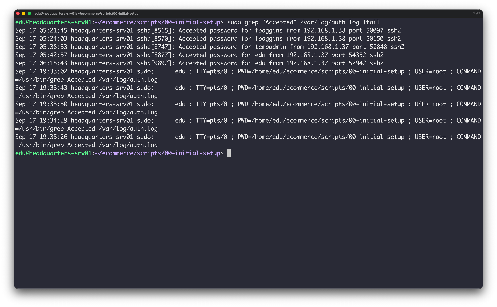
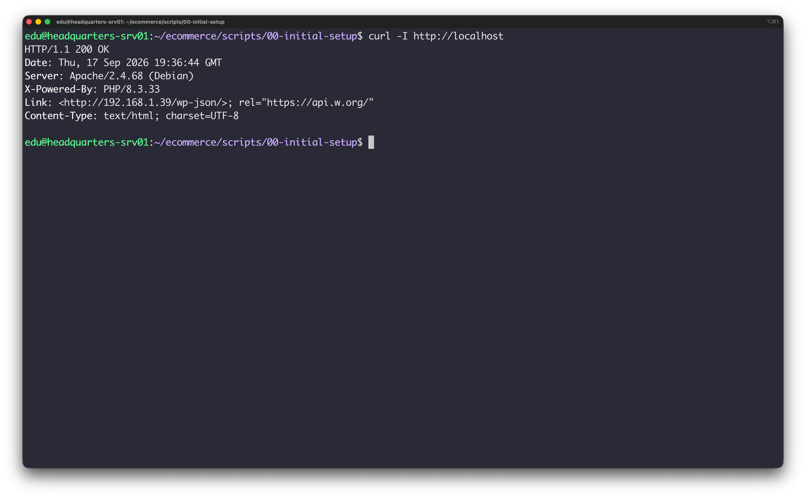
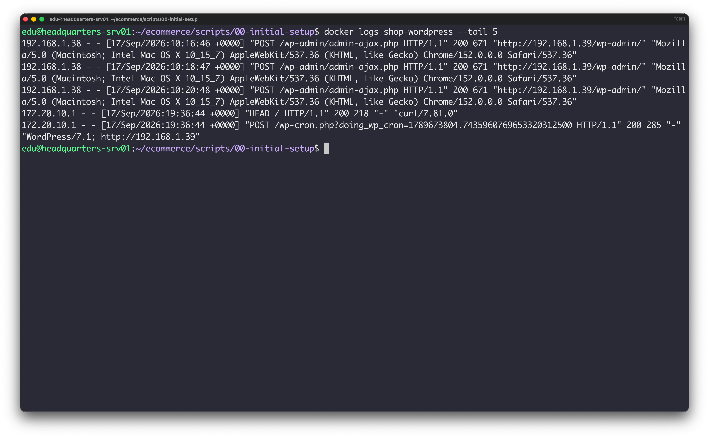
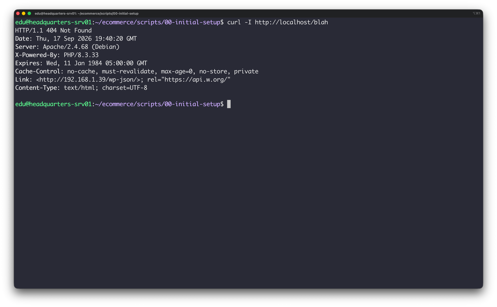
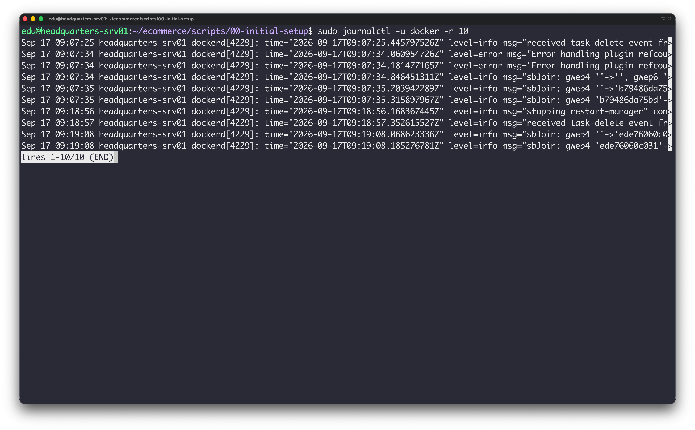

# Evidencias y Verificación 

## 1. Sincronización Horaria (Timestamps)

---

## 2. Auditoría de Accesos SSH (Host Linux)

### Login SSH Incorrecto

### Login SSH Correcto

---

## 3. Auditoría de Peticiones HTTP (Servicio Web / WordPress)

### Petición HTTP Correcta (Código 200)

### Petición HTTP Incorrecta (Código 404 Not Found)

---

## 4. Verificación de Registros en Docker

