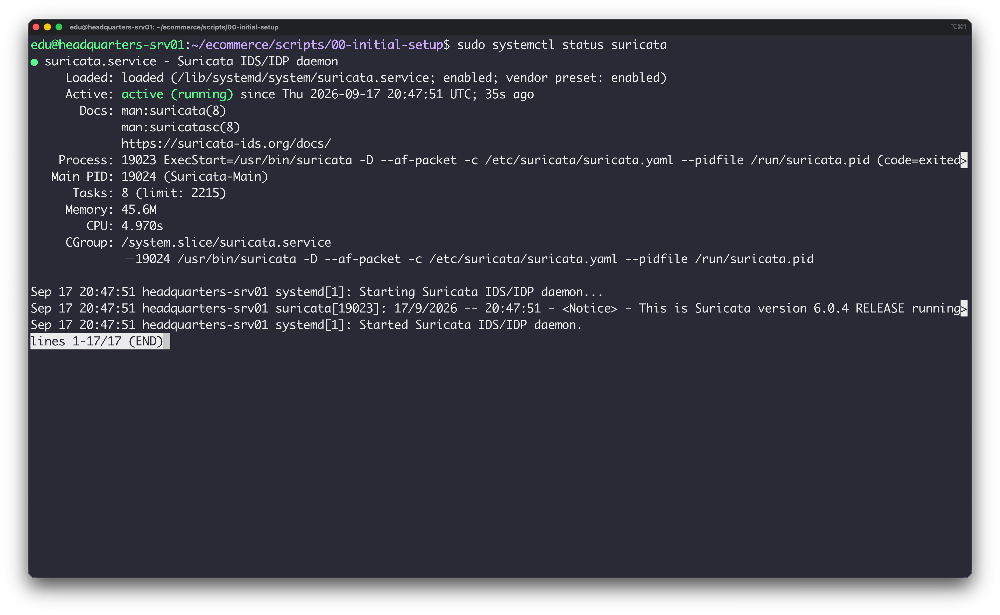
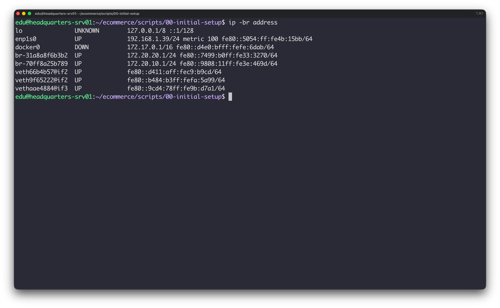
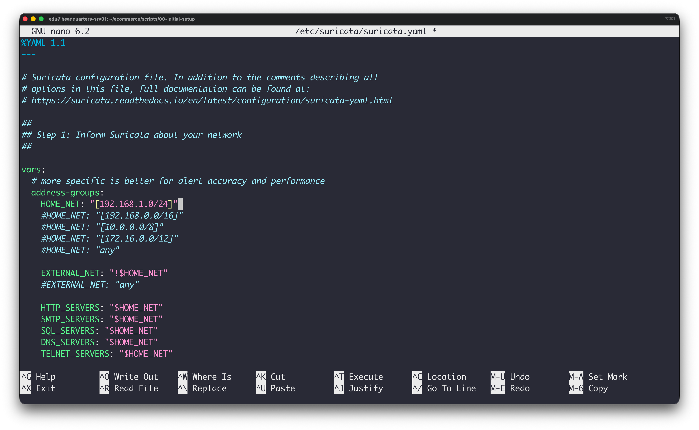
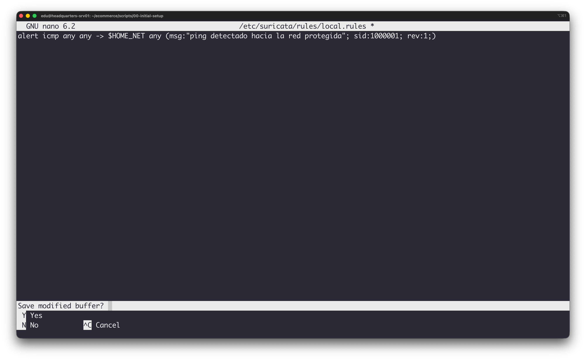
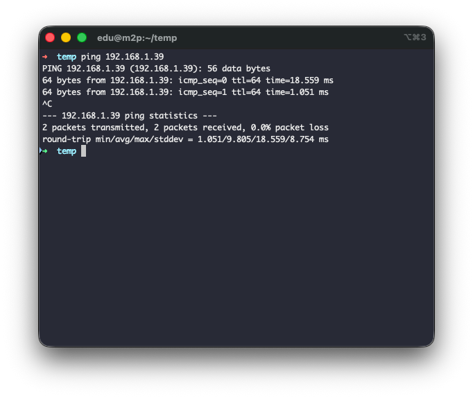
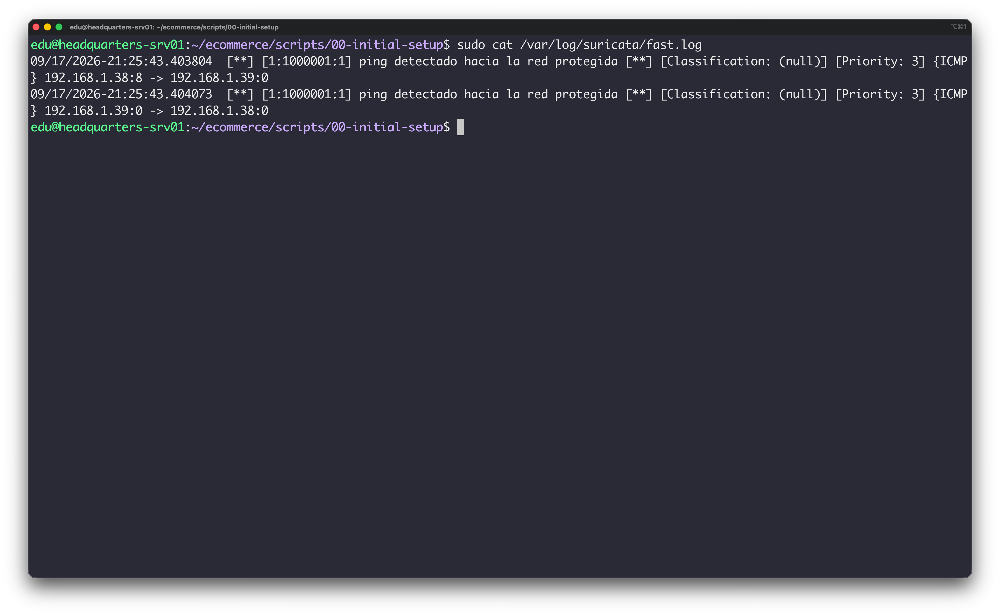
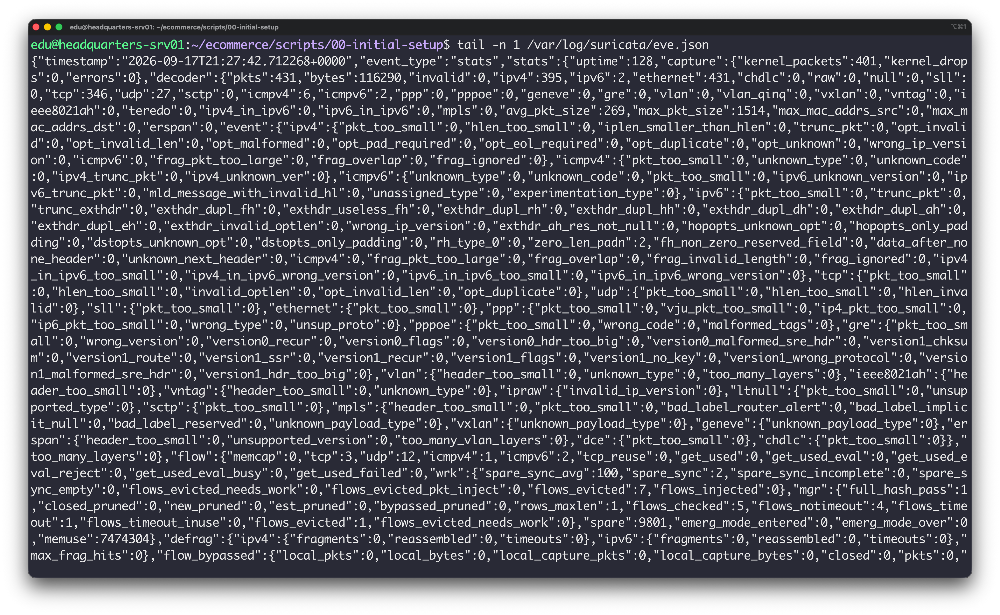

# Suricata - instalación y configuración

## 1. Instalación

* **Instalación:**
```bash
sudo apt update
sudo apt install suricata -y

```





## 2. Identificación de la Interfaz de Red

```bash
ip -br address

```



## 3. Configuración de `HOME_NET`



Ajustada la dirección de la subred a la subred específica.

## 4. Regla Propia

```
alert icmp any any -> $HOME_NET any (msg:"ping detectado hacia la red protegida"; sid:1000001; rev:1;)
```


- `alert`: genera una alerta al cumplirse el evento.
- `icmp`: protocolo a analizar.
- `any`: origen.
- `any`: destino dentro de la red local.
- `msg`: mensaje de alerta que se genera.
- `sid` (Signature ID): identificador único de la regla (a partir de `1000001` para reglas locales).
- `rev`: versión de la regla.


## 5. Prueba Real y Verificación de Logs




### Alertas generadas:





