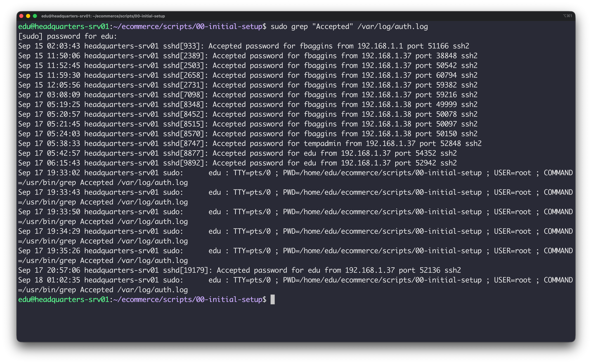
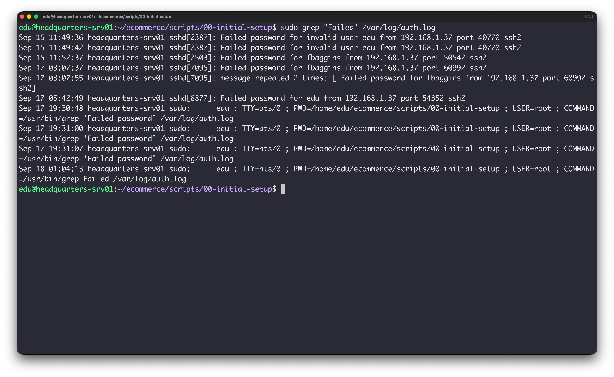
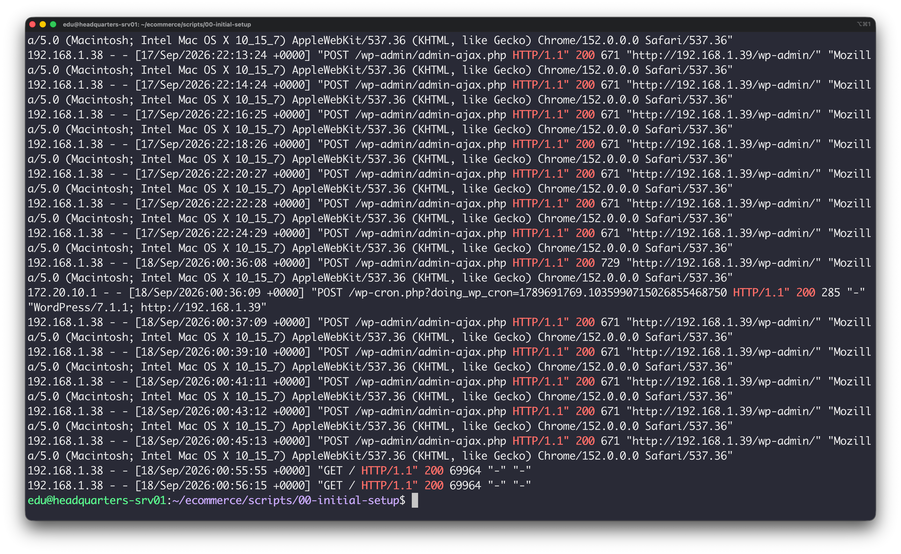
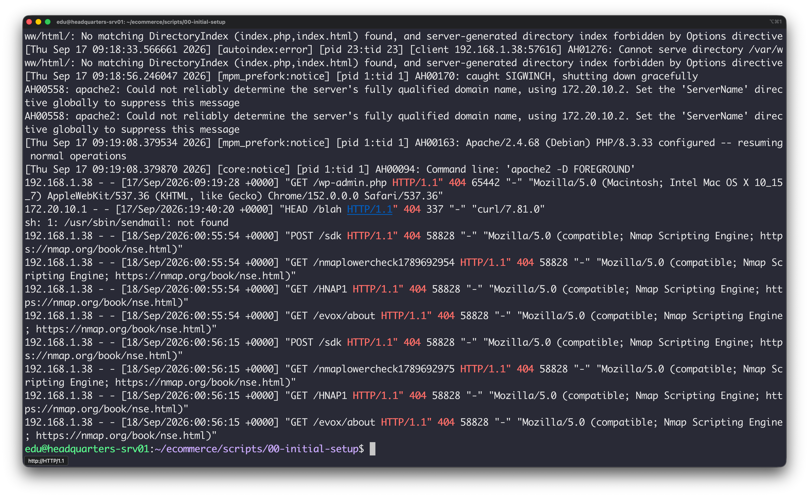
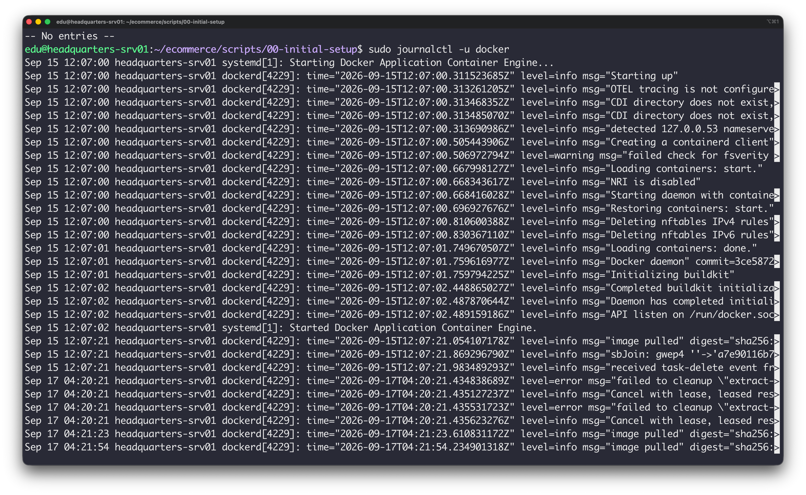
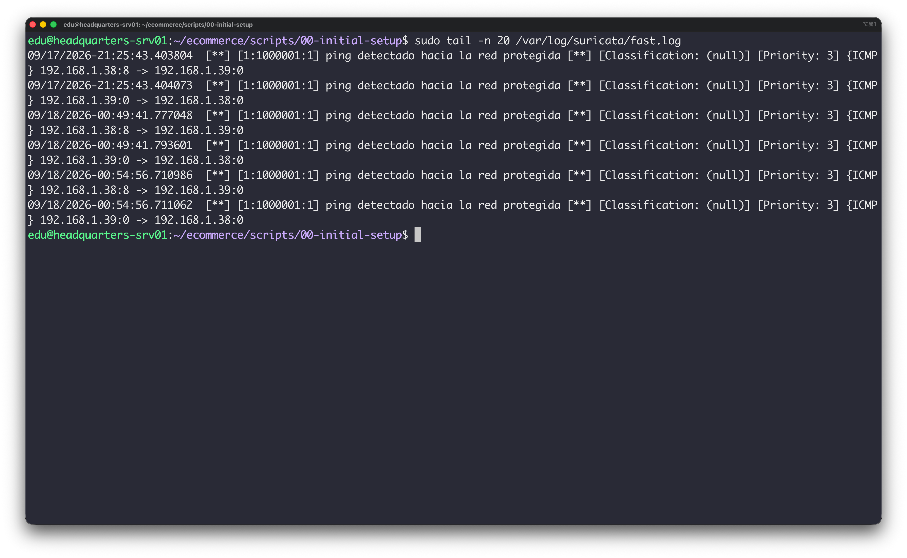
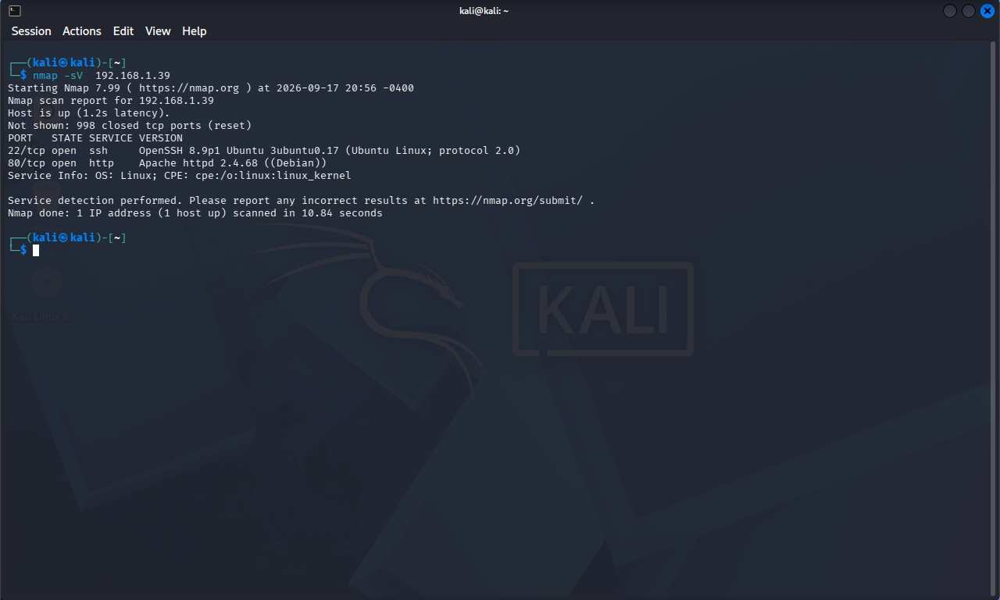

# Ejecución de Pruebas

- SSH correcto

	```bash
	sudo grep "Accepted" /var/log/auth.log
	```

	

- SSH incorrecto
	```bash
		sudo grep "Failed" /var/log/auth.log
	```

	

- Web válida

	```bash
	docker logs shop-wordpress | grep "HTTP/1.1\" 200"
	```
	

- Web 404

	```bash
	docker logs shop-wordpress | grep "HTTP/1.1\" 404"
	```

	

- Docker

	```bash
	sudo journalctl -u docker --since "1 hour ago"
	```

	

- Ping

	```bash
	sudo tail -n 20 /var/log/suricata/fast.log
	```
	


- Nmap

	```bash
	nmap -sV -p- 192.168.1.39

	```
	


